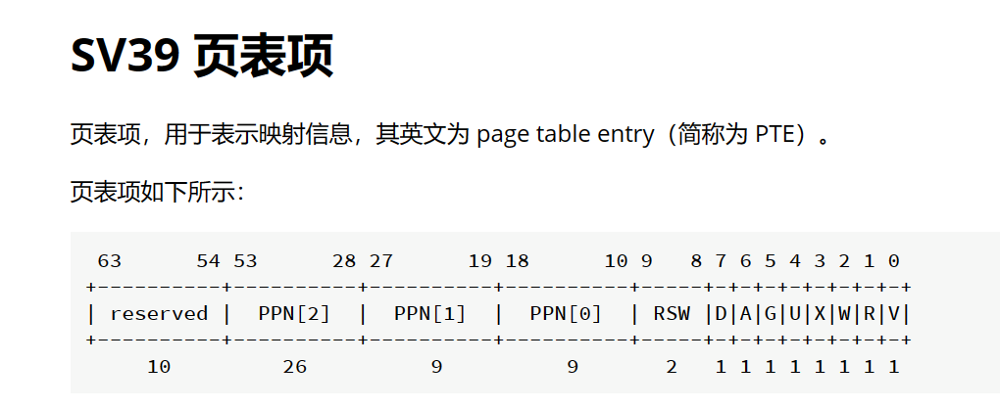

# 操作系统LAB2

计12 王嘉硕

### 实现功能

LAB2重写了`sys_get_time`和`sys_task_info`函数、并实现了`mmap`和`munmap`系统调用。

`sys_get_time`失效的原因是该函数是依靠传入的指针来获取`TimeVal`的。由于现在增加了虚拟内存，故而这里传入的`ts`是虚拟地址而非物理地址，因此函数无法从该地址获取正确的值。解决方法是将`ts`转换成物理地址，之后正常操作即可。`sys_task_info`也是同理，我们将`_ti`转换成物理地址即可。

对于`mmap`，我们需要先判断是否存在诸如“没有按页大小对齐”等错误，然后获取到当前任务的`memory_set`并应用已经实现的`insert_framed_area`函数插入页面即可。

对于`munmap`，我们需要先判断是否存在诸如“没有按页大小对齐”等错误，然后获取到当前任务的`memory_set`。与`mmap`不同的是，`delete_framed_area`在原框架中尚未实现，我们需要按照`insert_framed_area`的实现方法将其实现并应用。

### 简答题

1、请列举 SV39 页表页表项的组成，描述其中的标志位有何作用？

    如上图所示，其中标志位为：
    V：有效位，表示页表项是否 valid。
    R, W, X：这些位分别表示页面是否可读、可写和可执行。当所有三个都为零时，PTE 指向页面表的下一级；否则，它是一个 leaf PTE。
    U：用户位，表示对应虚拟页面是否可在用户态下访问。
    G：全局位，表示对应的页面是否是全局的。对于 non-leaf PTE，全局设置意味着页表后续级别中的所有映射都是全局的。请注意，未能将全局映射标记为全局只会降低性能，而将非全局映射标记为全局则是一个致命错误。
    A：访问位，表示对应的页面是否被访问过。
    D：脏位，表示对应的页面是否被写过。
    RSW：为内核程序预留，硬件不会对此做任何其他操作。

2、缺页指的是进程访问页面时页面不在页表中或在页表中无效的现象，此时 MMU 将会返回一个中断， 告知 os 进程内存访问出了问题。os 选择填补页表并重新执行异常指令或者杀死进程。

- 请问哪些异常可能是缺页导致的？

    缺页异常、保护错误异常（当进程试图访问其没有权限的内存区域时可能导致缺页异常）、页表错误异常（访问页表本身出现问题可能导致缺页异常）。

- 发生缺页时，描述相关重要寄存器的值，上次实验描述过的可以简略。

    PC：指向引起缺页异常的指令的地址。
    页表基址寄存器：保存着页表的起始地址，用于查找缺页所需的页面信息。
    缺页异常错误码寄存器：包含有关缺页异常的更多信息，如引起异常的原因、访问类型等。
    栈指针寄存器：如果发生了进程切换或者异常处理程序需要保存当前上下文，栈指针寄存器会指向当前栈的顶部。

缺页有两个常见的原因，其一是 Lazy 策略，也就是直到内存页面被访问才实际进行页表操作。 比如，一个程序被执行时，进程的代码段理论上需要从磁盘加载到内存。但是 os 并不会马上这样做， 而是会保存 .text 段在磁盘的位置信息，在这些代码第一次被执行时才完成从磁盘的加载操作。

- 这样做有哪些好处？

    节省资源：Lazy策略避免了在程序启动时一次性加载所有代码和数据到内存的开销。这样可以节省系统资源，因为并非所有程序的所有代码和数据都会被立即访问到。

    减少启动时间：延迟加载可以使程序启动更快，因为它只加载了程序运行所需的最小必要代码和数据。这对于大型程序尤其重要，因为它们可能包含大量的代码和数据，一次性加载会导致较长的启动时间。

    优化内存利用：Lazy加载使得内存可以被更有效地利用。因为只有当程序实际访问到某个页面时，才会将其加载到内存中。这意味着内存可以优先存放那些经常被访问的页面，而不是将整个程序都加载进内存可能导致内存浪费。

    更高的并发性：延迟加载允许更多的程序同时运行，因为它减少了每个程序初始化时的内存需求。这对于多用户系统或者服务器应用程序非常重要，因为它们需要支持大量并发请求。

其实，我们的 mmap 也可以采取 Lazy 策略，比如：一个用户进程先后申请了 10G 的内存空间， 然后用了其中 1M 就直接退出了。按照现在的做法，我们显然亏大了，进行了很多没有意义的页表操作。

- 处理 10G 连续的内存页面，对应的 SV39 页表大致占用多少内存 (估算数量级即可)？

    在SV39页表中，一级页表（Page Directory）有512个条目，每个条目指向一个二级页表（Page Table），二级页表有512个条目，每个条目指向一个物理页框。一般来说，一个页表条目大小在4字节到8字节之间。因此，SV39页表大致占用的内存大小在几百KB到几MB的数量级。

- 请简单思考如何才能实现 Lazy 策略，缺页时又如何处理？描述合理即可，不需要考虑实现。

    要实现Lazy策略，可以在用户进程申请内存时，先不立即分配物理内存和建立页表，而是只建立虚拟地址空间的映射关系，将页表项标记为未分配。只有当进程实际访问到某个虚拟地址时，才会触发缺页异常，然后再根据需要分配物理内存并建立页表。

    当发生缺页时，应首先检查访问的地址是否在进程的虚拟地址空间范围内，以及访问是否合法。

    如果访问合法但页面未分配，则操作系统根据需要分配物理内存，并在页表中更新对应的页表项，将其映射到新分配的物理页面。

    如果访问不合法（例如访问了未分配的虚拟地址或者权限不足），则操作系统会向进程发送信号或者终止进程。

    最后，操作系统更新页表项中的标志位，标记页面已分配，并重新执行引起缺页异常的指令，使进程能够继续执行。

缺页的另一个常见原因是 swap 策略，也就是内存页面可能被换到磁盘上了，导致对应页面失效。

- 此时页面失效如何表现在页表项(PTE)上？

    有效位：当页面被换出到磁盘上时，有效位通常会被清除，表示页面不再存在于内存中。

    访问位和修改位：当页面被换出到磁盘上时，访问位和修改位通常会被清除，因为页面已经不再在内存中，无法被访问或修改。

    换出位置指针：为了能够找回页面并重新加载到内存中，页表项可能会包含一个指向页面在磁盘上位置的指针或者标识符。这个指针或标识符通常会被设置为指向页面在磁盘上的位置，以便系统在需要时能够将页面重新换入内存。

3、双页表与单页表

为了防范侧信道攻击，我们的 os 使用了双页表。但是传统的设计一直是单页表的，也就是说， 用户线程和对应的内核线程共用同一张页表，只不过内核对应的地址只允许在内核态访问。 (备注：这里的单/双的说法仅为自创的通俗说法，并无这个名词概念，详情见 KPTI )

- 在单页表情况下，如何更换页表？

    在单页表情况下，要更换页表通常需要进行内核态的操作。操作系统会在进程切换或者发生特定的系统调用时，通过修改页表基址寄存器（Page Table Base Register，PTBR）来切换到新的页表。这样可以确保不同进程之间使用不同的页表，实现进程间的内存隔离。

- 单页表情况下，如何控制用户态无法访问内核页面？（tips:看看上一题最后一问）
  
    在单页表情况下，控制用户态无法访问内核页面可以通过在页表中设置相应的权限位来实现。具体地，内核页面的页表项可以设置为只允许内核态访问，而不允许用户态访问。这样就可以阻止用户态程序直接访问内核页面，从而增强了系统的安全性

- 单页表有何优势？（回答合理即可）

    单页表的主要优势在于简单高效。由于所有的线程共用同一张页表，节省了页表切换的开销，并且减少了页表操作所需的内存空间。此外，单页表的实现相对简单，容易管理和维护，适用于对内存管理要求不是特别严格的系统。

- 双页表实现下，何时需要更换页表？假设你写一个单页表操作系统，你会选择何时更换页表（回答合理即可）？
    在双页表实现下，需要更换页表的情况通常包括：
    进程切换：当操作系统调度器决定切换到一个新的进程时，需要将当前进程的页表切换为新进程的页表。
    内存映射变化：当进程动态分配或释放内存、动态加载或卸载模块时，可能会导致虚拟地址空间的映射关系发生变化，需要更新页表。
    内核态与用户态切换：在系统调用或异常处理过程中，可能需要从用户态切换到内核态，此时需要切换到内核态的页表。

    假设我写一个单页表操作系统，可能会选择在进程切换时更换页表，因为进程切换是页表切换的主要场景，而在其他情况下更换页表可能会增加额外的开销。

### 荣誉准则

1. 在完成本次实验的过程（含此前学习的过程）中，我曾分别与 **以下各位** 就（与本次实验相关的）以下方面做过交流，还在代码中对应的位置以注释形式记录了具体的交流对象及内容：

   > 代码方面没有和任何同学交流。

2. 此外，我也参考了 **以下资料** ，还在代码中对应的位置以注释形式记录了具体的参考来源及内容：

   > 除rcore实验文档外，我使用了 chatgpt 学习简答题中提出的概念和一些内容。

3. 我独立完成了本次实验除以上方面之外的所有工作，包括代码与文档。 我清楚地知道，从以上方面获得的信息在一定程度上降低了实验难度，可能会影响起评分。

4. 我从未使用过他人的代码，不管是原封不动地复制，还是经过了某些等价转换。 我未曾也不会向他人（含此后各届同学）复制或公开我的实验代码，我有义务妥善保管好它们。 我提交至本实验的评测系统的代码，均无意于破坏或妨碍任何计算机系统的正常运转。 我清楚地知道，以上情况均为本课程纪律所禁止，若违反，对应的实验成绩将按“-100”分计。