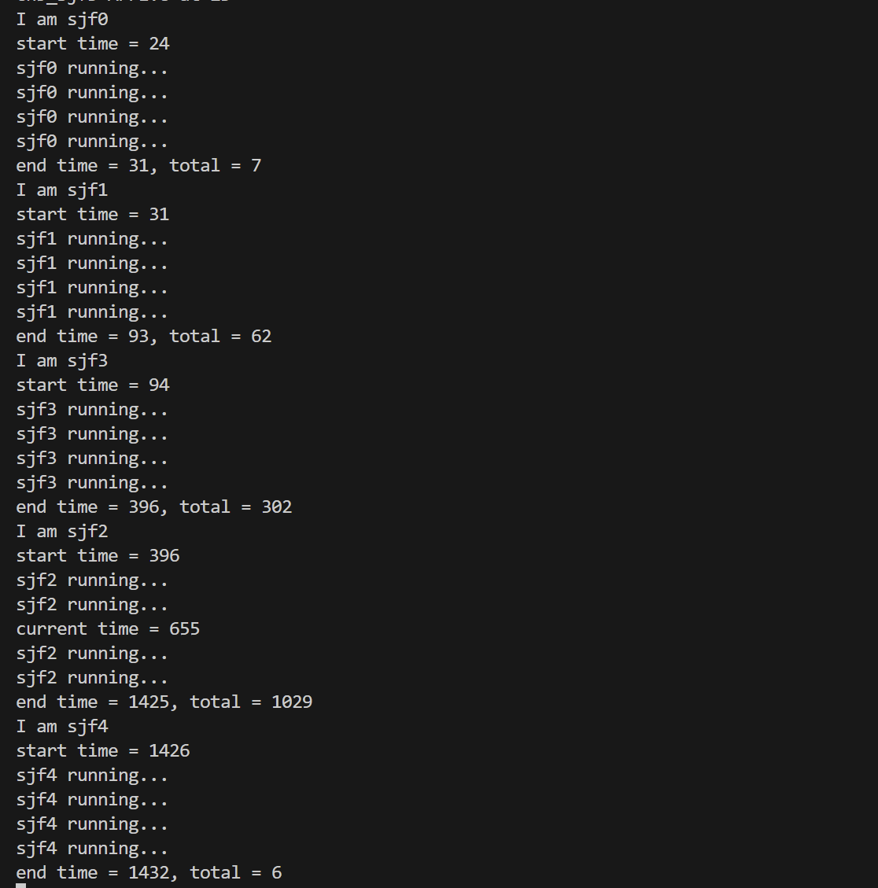
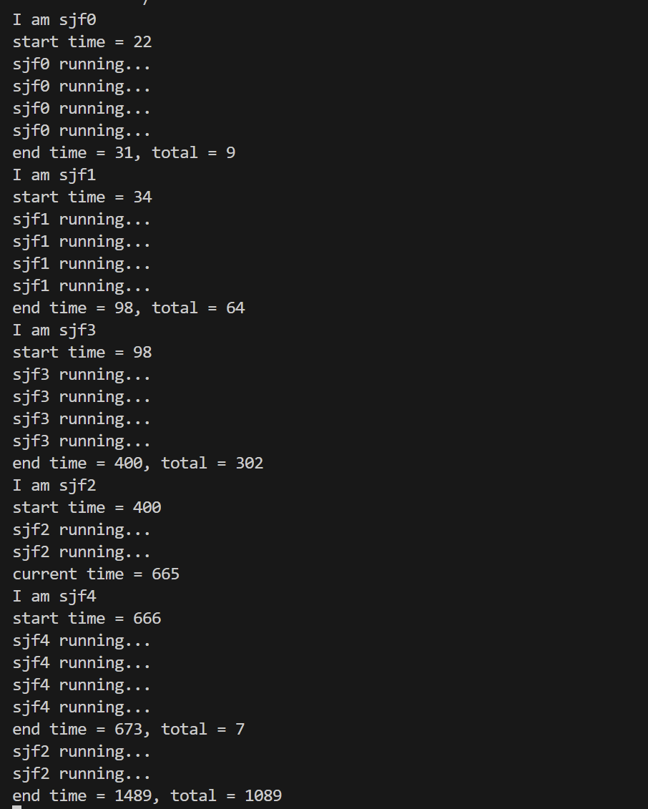

# 操作系统LAB3附加题

计12 王嘉硕

### 实现功能

在基础的 FCFS 和 STRIDE 调度算法之外，我额外实现了 SJF、HRRN 和 SRT 三种单处理器的调度算法。

首先，为实现 SRT 算法中的可抢占性，我们需要在 exec 和 spawn 中加入 suspend_current_and_run_next() 来允许当前任务重新与其他任务竞争 CPU 时间。然后，我们需要实现这三种算法所需要维护的数值：

```
    /// Estimated Runtime
    pub runtime: usize,

    /// Whether the process is running
    pub running: bool,

    /// The last time the process started
    pub task_last_start_time: usize,

    /// The remaining time of the process
    pub remain_runtime: isize,

    /// The last time the process yielded
    pub task_last_yield_time: usize,

    /// The time the process has been waiting
    pub task_waiting_time: usize,
```
其中，runtime 代表进程总用时，该值通过用户程序告知获取；running 代表该进程是否正在运行，在 SJF 和 HRRN 中用于确保避免抢占式调度；task_last_start_time 代表该进程上次开始时间，在 SRT 中用于计算 remain_runtime；remain_runtime 代表该进程剩余时间，用于 SRT 算法；task_last_yield_time 代表该进程上次让出 CPU 时间，用于计算 task_waiting_time；task_waiting_time 代表该进程等待时间，用于 HRRN 算法。

以 remain_runtime 的维护为例:我们在 exec 和 spawn 中将其初始化成进程总用时，即此时我们认为进程剩余时间 = 进程总用时。在 suspend_current_and_run_next 中我们用当前时间减去任务上次开始执行的时间来计算已经过去的时间，将剩余时间进行更新：`task_inner.remain_runtime -= (get_time_ms() - task_inner.task_last_start_time) as isize;`

对于 SJF，我们只需找到不同时运行的、总用时最短的进程即可：
```
    if running & !running_ {
        index_to_insert = index;
        break
    } 
    else if !running & running_ {
        continue
    }          
    if runtime < runtime_ {
        index_to_insert = index;
        break
    }

```

对于 HRRN，我们需要找到相应比最高的进程（相较 SJF 的主要改动就是判断条件的改动）：
```
    if running & !running_ {
        index_to_insert = index;
        break
    } 
    else if !running & running_ {
        continue
    }      
    if (waiting_time / runtime) > (waiting_time_ / runtime_) {
        index_to_insert = index;
        break
    }
```

对于 SRT，我们需要找到剩余时间最短的进程。此时我们不必考虑是否正在运行，因为 SRT 是可抢占的：
```
    if remain_runtime < remain_runtime_ {
        self.ready_queue.insert(index, task);
        return
    }
```


### 测试用例与分析

设计的测试用例如下：
```
#![no_std]
#![no_main]

#[macro_use]
extern crate user_lib;

static TESTS: &[&str] = &[
    "ch5_sjf0\0",
    "ch5_sjf1\0",
    "ch5_sjf2\0",
    "ch5_sjf3\0",
];

static TIMES: [usize;4] = [
    10,
    50,
    1200,
    300,
];

use user_lib::spawn;

#[no_mangle]
pub fn main() -> i32 {
    let mut i = 0;
    let mut pid = [0; 4];
    for test in TESTS {     
        pid[i] = spawn(*test, TIMES[i]);
        
        i += 1;
    }
    0
}
```
我们将 ch5_sjf0 ~ ch5_sjf3加载到内存中，告知操作系统每个程序大概的总用时分别是10、50、1200、300 ms，然后等待调度算法的调用。每个 ch5_sjfi 都是循环次数不同的无意义循环，均会打印四次 running 的输出：
```
for i in 0..4000000{
        c = (a + b) % 1000007;
        a = b;
        b = c; 
        if i % 1000000 == 0{
            println!("sjf0 running...");
        }
    }
```

为了测试 SRT 算法的抢占性，ch5_sjf2 在循环次数到一半次数时，我调用了用时大约为 10 ms 的 ch5_sjf4，即：
```
for i in 0..400000000{
        c = (a + b) % 1000007;
        a = b;
        b = c; 
        if i % 100000000 == 0{
            println!("sjf2 running...");
        }
        if i % 400000000 == 100000001{
            println!("current time = {}",get_time());
            spawn("ch5_sjf4\0", 10);
        }
    }
```

最终测试结果为：
对于 SJF 和 HRRN 算法，测试结果如下：


对于 SRT 算法，测试结果如下：


可见在 SJF 和 HRRN 算法中，ch5_sjf2 会先执行完再交由 ch5_sjf4 执行，而在 SRT 算法中，ch5_sjf2 会直接被调度算法切换到剩余时间更短的 ch5_sjf4，其执行完会重新回到 ch5_sjf2 执行。

正如课件中所说，倘若用户欺骗操作系统，告知的总用时与实际不符，例如本测例中将用时最长的 ch5_sjf2 告知为 10 ms，那么 SJF 和 HRRN 算法会出现错误的调度，从而导致平均周转时间变差。

### 可脱离OS独立存在的库

暂未实现。

### 荣誉准则

1. 在完成本次实验的过程（含此前学习的过程）中，我曾分别与 **以下各位** 就（与本次实验相关的）以下方面做过交流，还在代码中对应的位置以注释形式记录了具体的交流对象及内容：

   > 代码思路参考了马思源学长的毕业设计。但具体量的维护均由我自己编写；测例也由我本人（借由助教学长的提示）所写。

2. 此外，我也参考了 **以下资料** ，还在代码中对应的位置以注释形式记录了具体的参考来源及内容：

   > 无。

3. 我独立完成了本次实验除以上方面之外的所有工作，包括代码与文档。 我清楚地知道，从以上方面获得的信息在一定程度上降低了实验难度，可能会影响起评分。

4. 我从未使用过他人的代码，不管是原封不动地复制，还是经过了某些等价转换。 我未曾也不会向他人（含此后各届同学）复制或公开我的实验代码，我有义务妥善保管好它们。 我提交至本实验的评测系统的代码，均无意于破坏或妨碍任何计算机系统的正常运转。 我清楚地知道，以上情况均为本课程纪律所禁止，若违反，对应的实验成绩将按“-100”分计。